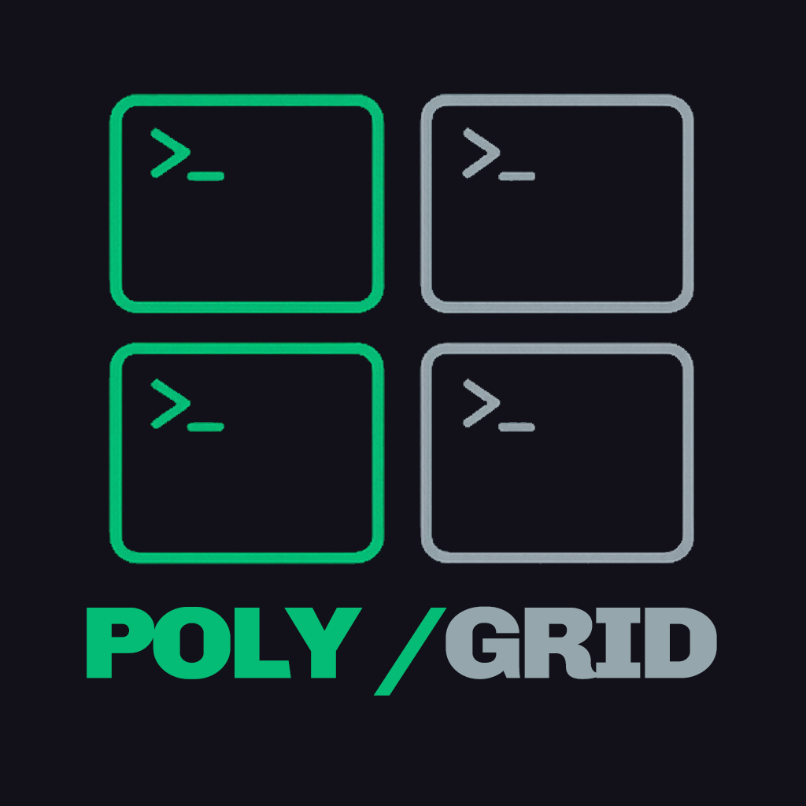
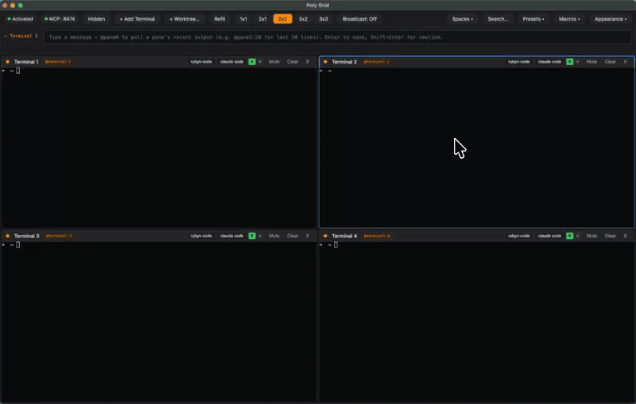
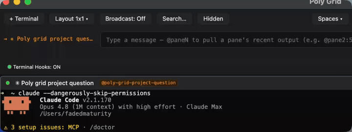
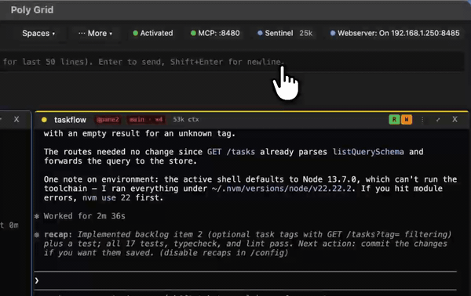
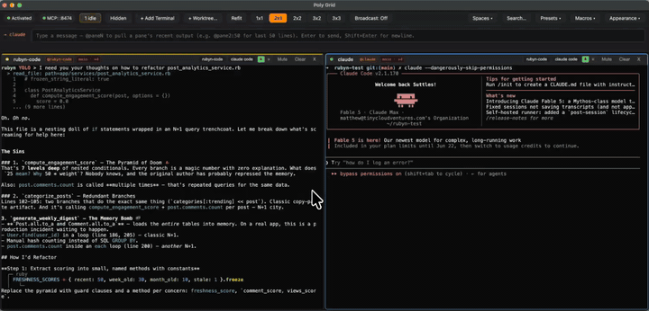
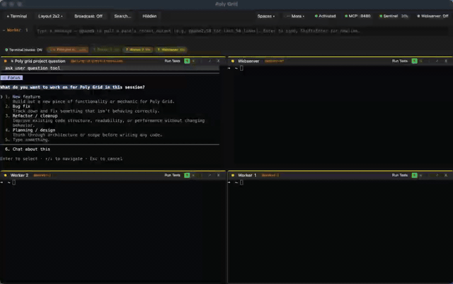

### Stop setting up. Start working.

One-click AI agent workspaces for macOS. Save your whole rig — agents, layout,
working directories, initial prompts — and load it back in a click.
Like `tmuxinator`, except your agents are already running — and you can see what
every one of them is doing.

---

  
  
<a href="assets/preset-cold-start.mp4">↗ Watch full quality (MP4)</a>

---

> You've typed `cd ~/projects/foo && claude` four hundred times. Stop.

## What it does

| | |
|---|---|
| **Presets** | Save the whole grid — agents, layout, working directories, per-pane initial prompts — as a named bundle. Load it later and the whole grid spins up. Agents already running. |
| **Live agent status** | Every pane reports its own state — working, awaiting input, awaiting permission, stalled — pushed straight from your agent's lifecycle hooks. Header dots and a triage strip show who needs you. No terminal scraping. |
| **Works with Claude Code, Codex & opencode** | Status capture runs across all three through sibling adapters. The dots, triage strip, and tools behave identically no matter which agent is in a pane. |
| **Sentinel** | An opt-in watchdog that watches pane output, summarizes what each agent is doing, and raises safety alerts. It observes, never acts. Connect it to a model you already have — your Claude subscription, an Anthropic or OpenAI key, or a local Ollama — or leave the model off and the deterministic safety rules keep firing. |
| **Context meter** | Each pane header shows live token usage — `82k ctx` — read from the agent transcript at every turn boundary. Absolute counts, no guesswork. |
| **Macros** | The commands you retype forty times a day, one click away. Pin `/clear`, `make test`, `git status` to a pane header — send to the focused pane or the broadcast group. |
| **Spaces** | Every project's rig, saved. Switch between projects, agent roles, or workflows without losing pane state. Restored exactly as you left them on next launch. |
| **Broadcast** | Type once, send to every selected pane. Same prompt, three agents, instant compare. |
| **`@mentions`** | `@pane2:50` pulls the last 50 lines of that pane's output into your prompt. Hand context between agents without copy-paste. |
| **MCP server** | Local HTTP server (`127.0.0.1` only, bearer-token auth) exposes panes to Claude Desktop, Cursor, and Cline. Read/write panes from any MCP client. |
| **Webserver** | View and drive your panes from a phone or tablet — over your Wi-Fi, or from anywhere through a tunnel like Tailscale or Cloudflare. Configurable port, optional login password. Off by default. |
| **Auto-Compact** | Sends `/compact` to a pane the moment its context crosses your threshold, at a clean turn boundary. Panes stay lean; per-turn spend stays down. |
| **Cross-pane search** | Find any string across every pane's live buffer and scrollback history (`⌘⇧F`). |
| **Worktree panes** | `New worktree pane…` runs `git worktree add` and spawns a pane there, labeled with the branch. Cleanup on close. |
| **Pane attention** | Free in-app activity dots. Pro out-of-app delivery (OS notifications, dock bounce, sound) when an idle pane needs you. |
| **Power-user surface** | Command palette (`⌘⇧P`), `⌘1`–`⌘9` pane focus, `⌘⌥H/J/K/L` vim-style direction nav, pane zoom, copy mode, drag-to-resize, customizable keybindings, `?` for the full shortcut sheet. |

---

## See it in action

### Live fleet status — every agent's state, at a glance

  
  
<a href="assets/fleet.mp4">↗ Watch full quality (MP4)</a>

### Sentinel — a safety net watching every pane

  
  
<a href="assets/sentinel.mp4">↗ Watch full quality (MP4)</a>

### MCP — Claude Desktop and Cursor drive your panes

  
  
<a href="assets/mcp.mp4">↗ Watch full quality (MP4)</a>

### Webserver — your whole fleet, on your phone

  
  
<a href="assets/webserver.mp4">↗ Watch full quality (MP4)</a>

---

## Why not just tmux?

tmux is free, scriptable, and great. If you've already wired up a `tmuxrc` plus `tmuxinator` for your AI workflow, you probably don't need this.

Poly Grid is for the rest of us — people who want the rig pre-built, not scripted. Presets in a dropdown, macros as buttons, no `.conf` to maintain. And because it's GUI-native, the same workspace your terminal sees is also reachable from Claude Desktop, Cursor, and Cline over MCP — no socket-passing, no `tmux send-keys` glue. On top of that, every pane tells you what its agent is actually doing, so a roomful of agents is something you can watch instead of babysit.

---

## Install

1. Download the latest DMG from **[Releases](https://github.com/tiny-cloud-ventures/poly-grid/releases/latest)**:
   - `Poly-Grid-<version>-arm64.dmg` — Apple Silicon
   - `Poly-Grid-<version>.dmg` — Intel
2. Open the DMG and drag **Poly Grid.app** into your Applications folder.
3. Launch. The first time, macOS may ask you to confirm the app — it's signed and notarized by Apple, so right-click → Open is enough.

The app **auto-updates** via `electron-updater`. New versions install themselves in the background and prompt to restart when ready.

---

## Pricing

- **Free forever:** the multi-pane grid plus the whole fleet console — live agent status, the triage strip, Sentinel, and the context meter. Spawn panes, set layouts, type into them, and see what every agent is doing. That's yours.
- **7-day free trial** of the orchestration features (presets, macros, spaces, broadcast, `@mentions`, MCP server, attention notifications, scrollback search, Webserver, Auto-Compact).
- **$20 one-time, 3 machines** to unlock everything after the trial.

**[→ Buy a license](https://tinycloud.lemonsqueezy.com/checkout/buy/23ac2124-877b-4d75-8687-e063ef2c51e1)**

Activation lives in `~/.poly-grid-license`, encrypted with a machine-derived key, so reinstalling or upgrading macOS won't reset your trial or activation slot — and there's no keychain prompt on first run.

---

## System requirements

- macOS 11 (Big Sur) or later
- Apple Silicon or Intel
- ~150 MB disk
- Internet for license activation and auto-updates (7-day offline grace built in)

Linux builds (AppImage and `.deb`) now ship alongside macOS. A Windows build is on the roadmap.

---

## Privacy

Poly Grid ships with **opt-in** product analytics (powered by [Aptabase](https://aptabase.com/), open-source and privacy-first). First launch asks you explicitly; you can toggle it any time from **Help → Privacy…**.

When on, the app sends:

- A random install ID, app version, OS family
- Six named funnel events (`app_launched`, `pane_command_typed`, `pro_feature_attempted`, `license_modal_opened`, `license_activated`, `app_quit`)
- Small counters (trial days left, session count, panes open)

It **never** sends:

- Pane contents, commands you type, or terminal output
- File paths, working directories, or git remotes
- License keys, your email, or your machine's hostname

A hardened redactor at the boundary drops the entire event if anything path-shaped, license-shaped, email-shaped, or homedir-leaking sneaks in. The full policy lives at [poly-grid.com/privacy](https://poly-grid.com/privacy).

The agent status hooks, Sentinel, and the Webserver all stay on your own machine — status events post to a listener bound to `127.0.0.1`, Sentinel only reads pane output to classify state (it never sends keystrokes), and the Webserver binds to your LAN so you decide who can reach it.

---

## Support

- Feature requests + bug reports: [open an issue](https://github.com/tiny-cloud-ventures/poly-grid/issues)
- Direct support for license holders: email the address on your purchase receipt

---

## License

Poly Grid is **proprietary software**, sold via Lemon Squeezy. The source code is closed; this repository hosts the public release binaries, documentation, and asset previews only.

**© Tiny Cloud Ventures.** All rights reserved.
